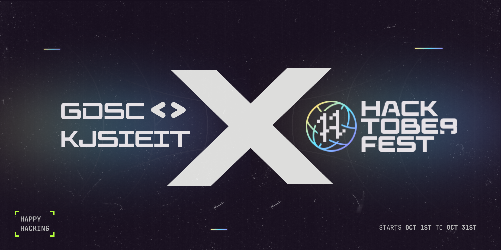

# Hacktoberfest
## KickStart to Open Source Event 

## What is Hacktoberfest?
A month-long celebration from October 1st - 31st sponsored by [Digital Ocean](https://hacktoberfest.digitalocean.com/) and [GitHub](https://github.com/blog/2433-celebrate-open-source-this-october-with-hacktoberfest) to get people involved in [Open Source](https://github.com/open-source). Create your very first pull request and contribute to the open source developer community.

## How to contribute to this repository
* Fork this repository (Click the Fork button in the top right of this page, then click at your profile)
* Clone your fork down to your local machine

```markdown
git clone https://github.com/your-username/hacktober-fest.git
```

* Complete the task. (Details of the task are provided in the section below)
* Commit and push

```markdown
git add .
git commit -m "Commit message"
git push origin branch-name
```

* Create a new pull request from your forked repository (Click the `New Pull Request` button located at the top of your repo)
* Wait for your PR review and merge approval!
* __Star this repository__ if you had fun!


## Task Details/Problem Statements
### A. Web Development.
* 1. Design a Interactive Webpage which fetches News using News API
* 2. Design User Interface for a static Blog Website  
* 3. A Quiz Web-App using React.js

### B. App Development.
* 1. Create a password manager app
* 2. Medicine tracker/ Reminder app
* 3. Food Ordering app

### C. Competetive Programming
* 1. It is interesting to find the factorial of a number, and calculating it is also not a big deal. But geeks it is the hacktober fest  and you have to calculate the factorial using recursion in any language. 
* 2. Given a matrix if an element in the matrix is 0 then you will have to set its entire column and row to 0 and then return the matrix. Try to optimise for time.
* 3. Given two sorted arrays arr1[] and arr2[] of sizes n and m in non-decreasing order. Merge them in sorted order. Modify arr1 so that it contains the first N elements and modify arr2 so that it contains the last M elements. Try to solve with Linear Space Complexity.
* 4. Given a string s, reverse the words of the string. Optimise for O(n) time and O(1) space complexities.
* 5. Given an array of N integers, and a number sum, the task is to find the number of pairs of integers in the array whose sum is equal to sum. Optimise for O(n) time and space.
* 6. Given a String, find the length of longest substring without any repeating character. Try to obtain O(n) time and Space Complexity.
* 7. You are given an array ,find the contiguous subarray (containing at least one number) which has the largest sum and return its sum. The solution should be strictly in O(n).

### D. AI/ML
* 1. Face detection logic in any language
* 2. Data Prdeiction Model for any business purchase

### E. Blockchain
* 1. Write a lottery smart contract using solidity language
* 2. Write an ecommerce smart contract using solidity language
* 3. Write a smart contract for creating a NFT
* 4. Write a smart contract for generating ERC-20 tokens

### F. UI/UX
* 1. Design a logo for a Fintech company.
* 2. Design a dashboard page for a tracker app.
* 3. Design a landing page for a portfolio website (generic).

## Rules for making PULL REQUEST

* 1. Except for competitive programming you have to add folder (not files) as a solution in the respective fodlers

* 2. For Competetive programming questions add files (any language) into the respective folder

* 3. Last step is to add your name and details in the md file in the respective folder

* 4. Test cases for competitive programming questions are mentioned in info.md file
